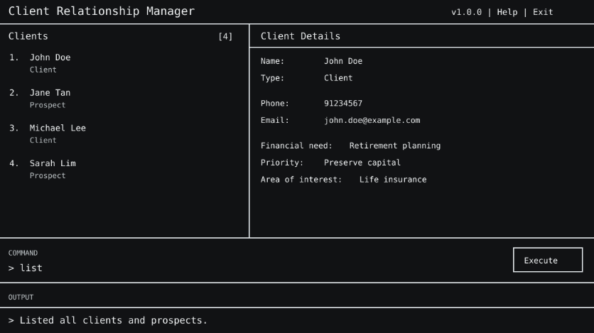

* ClientBook is a desktop application designed for financial consultants who manage relationships with a large number of clients.
* Financial consultants often need to remember important personal details about their clients, such as birthdays, anniversaries, family information, interests, previous conversations, and significant life events. As the number of clients grows, remembering and retrieving this information quickly before or during a client interaction can become difficult.
* ClientBook helps financial consultants keep track of their clients' details and personal context, allowing them to quickly recall important information and maintain more personalised and informed client relationships.
* For detailed documentation, see the [ClientBook Product Website](https://ay2627s1-cs2103t-f14a-4.github.io/tp/).