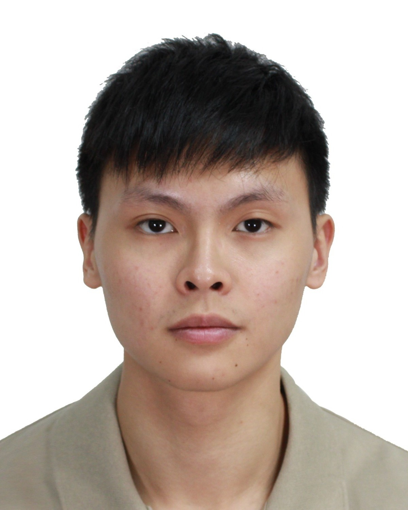
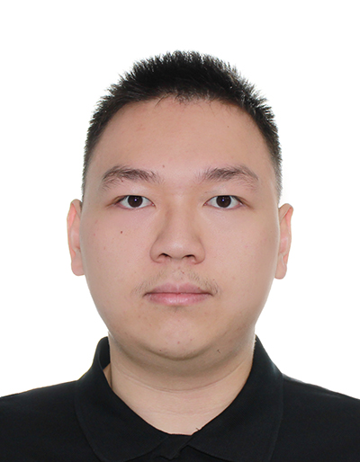
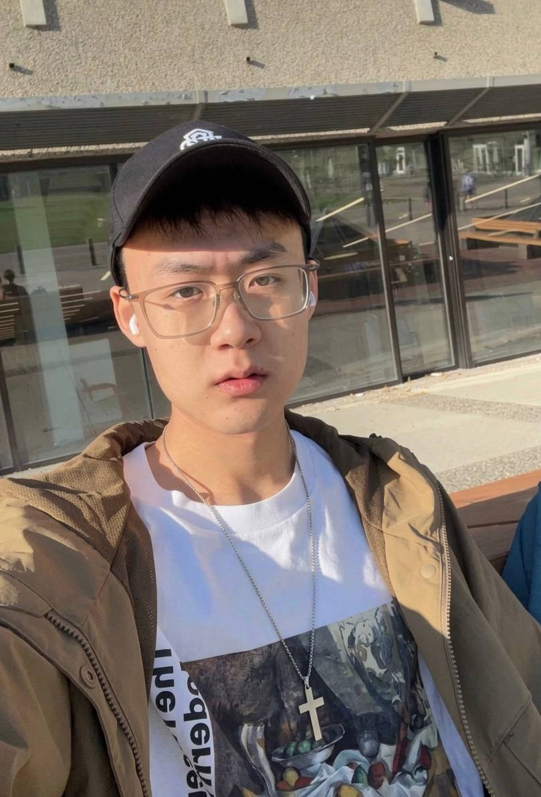
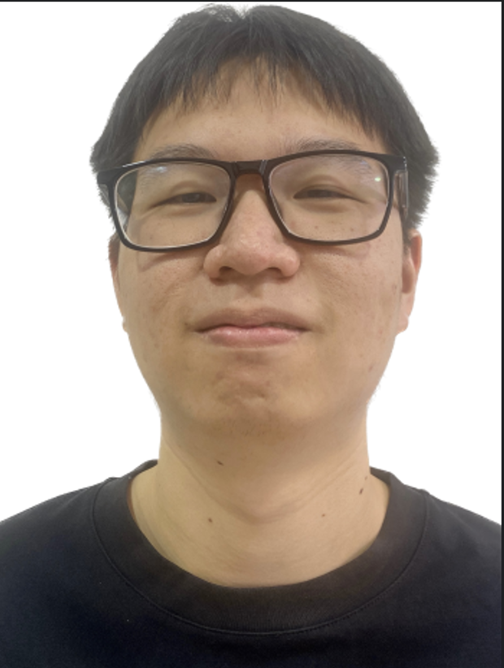

# About Us

We are a team based in the [School of Computing, National University of Singapore](http://www.comp.nus.edu.sg).

You can reach us at the email `seer[at]comp.nus.edu.sg`

## Project team

### Phu Xien

[[homepage](http://www.comp.nus.edu.sg/~damithch)]
[[github](https://github.com/PhuXien)]

* Role: Project Advisor

### Nicholas Goh

[[github](https://github.com/Nicholas-gohh)]

* Role: Team Member
* Responsibilities: Git organization maintenance

### Xian Han

[[github](https://github.com/KoeyXianHan123)]

* Role: Team Member
* Responsibilities: Logic / Commands

### Junhan Liu

[[github](https://github.com/ZachL1113)]

* Role: Team Member
* Responsibilities: Data/Storage

### Jean Doe

[[github](http://github.com/johndoe)]
[[portfolio](team/johndoe.md)]

* Role: Developer
* Responsibilities: Dev Ops + Threading

### Tan Wei Jie

[[github](http://github.com/JokThreee)]

* Role: Team Member
* Responsibilities: Logic / Commands
